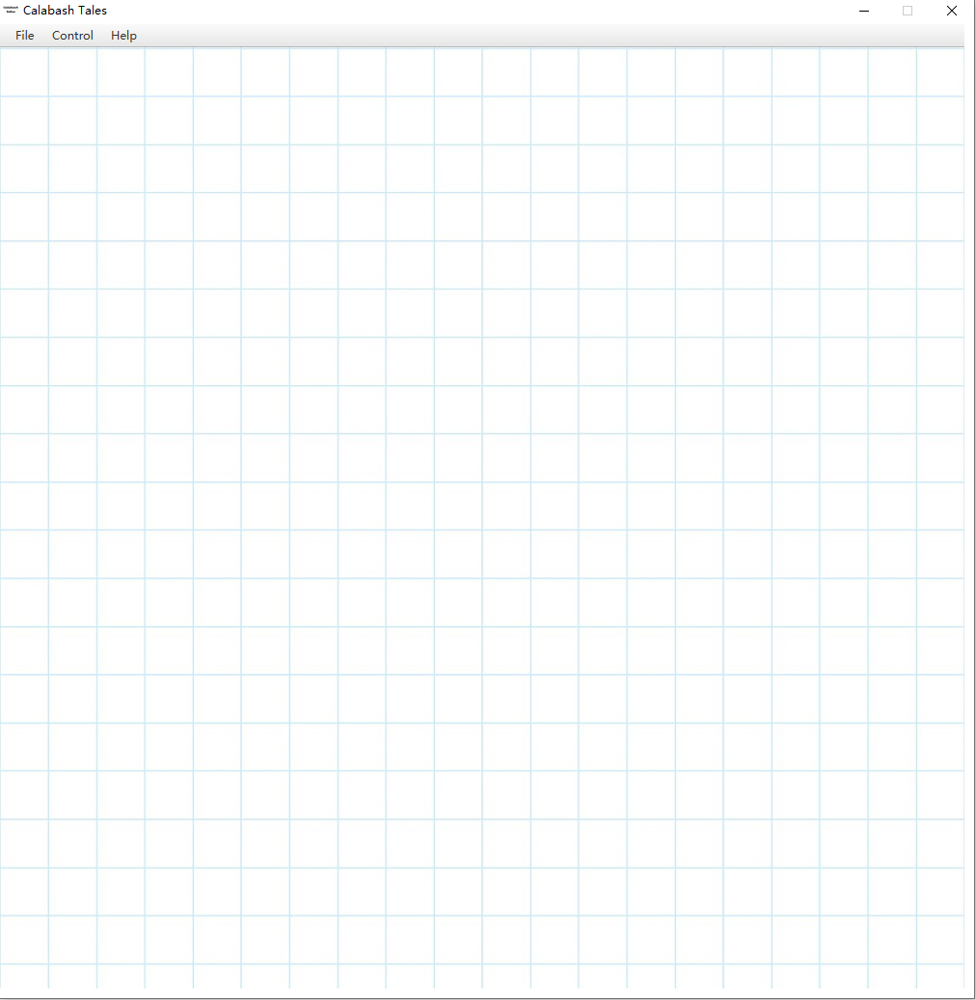
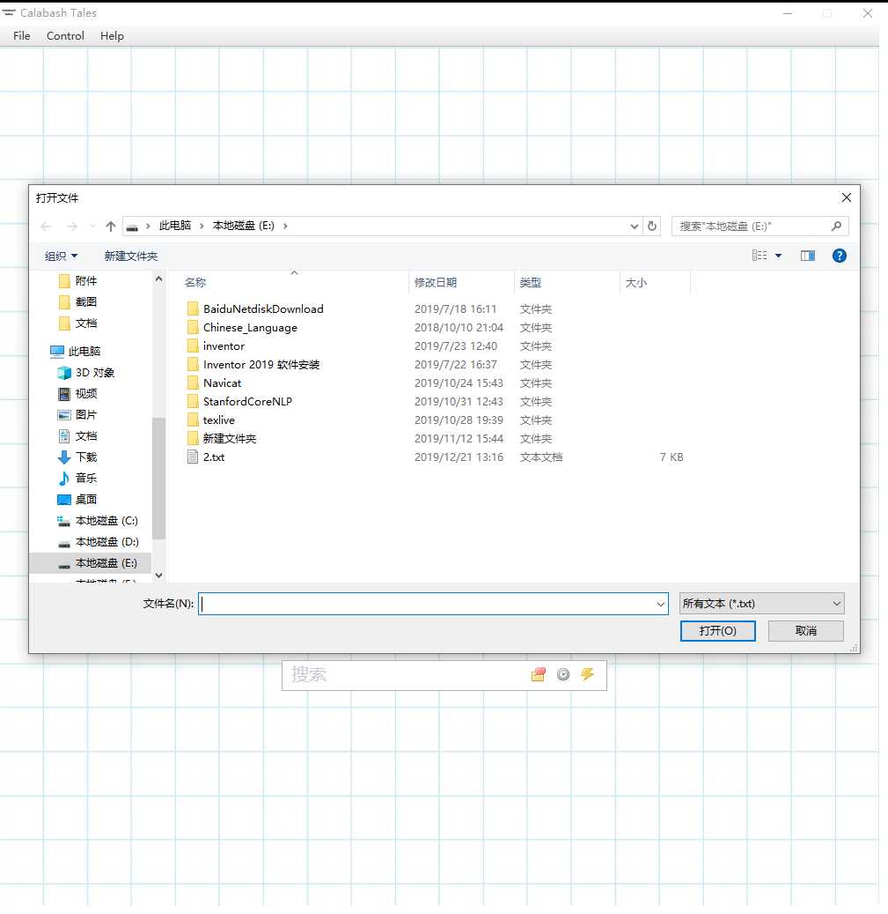
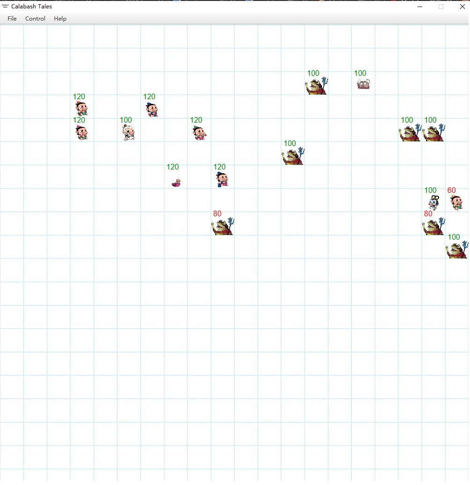
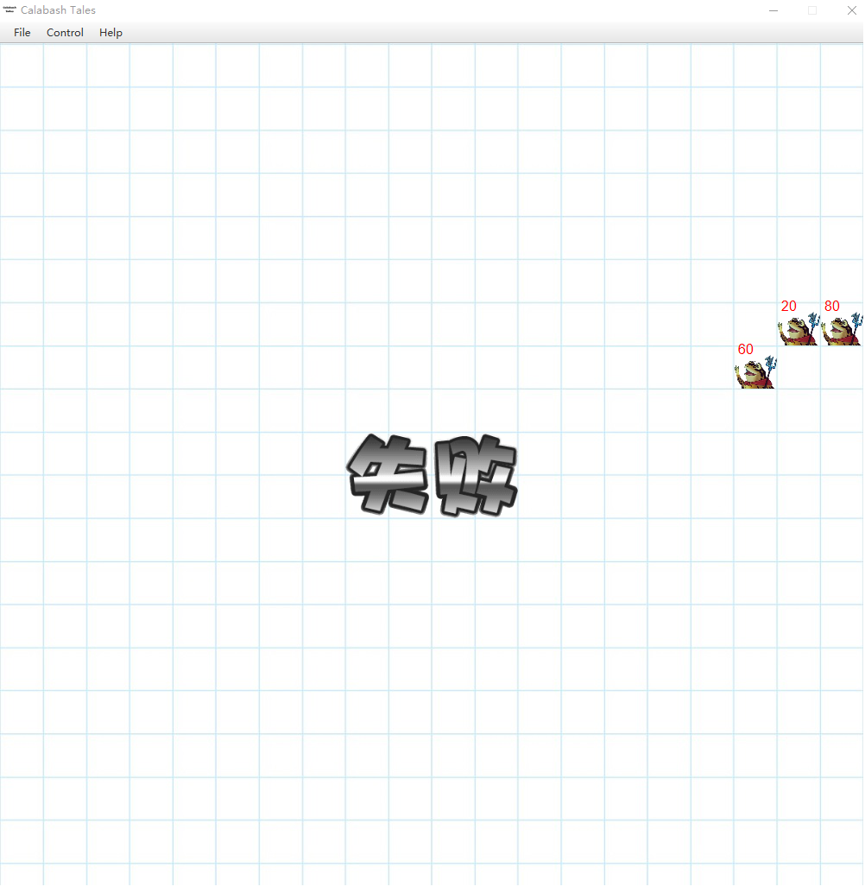
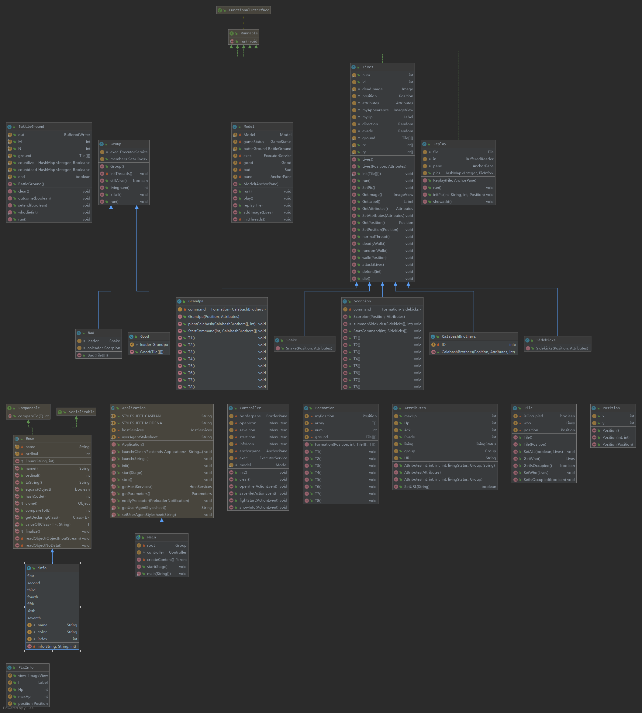
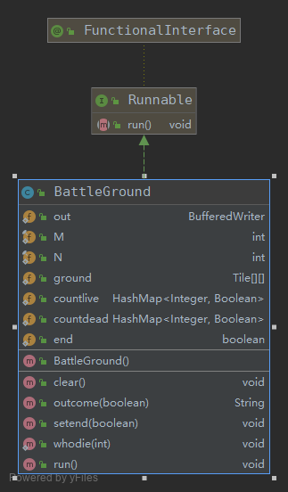
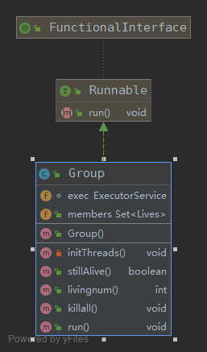
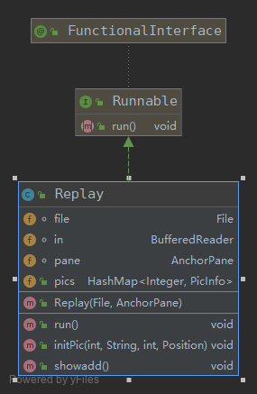
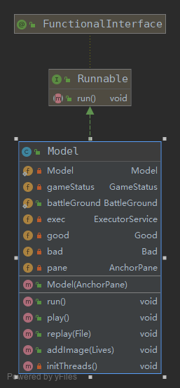

# JAVA大作业文档
## 开发环境 ##
- IntelliJ IDEA Community Edition 2019.2.3 x64
- jdk-8

## 介绍

主界面为一个大小为1000*1000像素的棋盘，棋盘划分为20*20块，每一块被葫芦娃及其血量等占据。

当用户点击File选项时弹出Open选项，点击即可打开一个文件栏，读取固定格式的txt文件，可以完成回放的功能。

点击Control按钮会弹出选项start，点击即可开始运行战斗。空格键有相同的效果。战斗前可以在controller中的formation选项中调整阵型。会弹出对话框以供选择。

当正义的葫芦娃一方或者邪恶的怪兽一方全部死亡时，战斗结束。如果葫芦娃失败，则播放失败图标，否则播放成功图标。

当战斗还未开始或者已经结束后，再次按空格键或L键可以选择战斗或者回放。

## 程序设计
### UML图展示

程序采用了MVC的设计模式，Controller类负责与外界的交互，Model是Controller的一个细分，负责统筹所有Model,同时负责与Controller交互。由于采用了JAVAFX，所以GUI显示的组件由FXML文件提供。

### 主要类说明

生物体是一种较为主要的模型类，每个生物具有位置，属性（包含血量，攻击力，闪避能力，状态，阵营等），当前生物编号，外貌（即图片，用于View中显示），以及一些其他辅助属性。

生物体线程的运行逻辑为，在初始化完成之后，开始游走，游走分成两种走法，deadlywalk和randomwalk, deadlywalk会在地图中选取一个敌人，直接快速跑过去，并且对范围内的敌人造成攻击，randomwalk是上下左右四个方向随机走动，一次只能攻击一个敌人。系统设置为一个生物在一次游走中，有七分之一的概率会deadlywalk，剩下大多数时间为随机游走。

攻击的方法在游走中调用，当生物体走到一个新的地方，会检查周围是否存在不同阵营的敌人，如果发现，则调用攻击，敌人会受到信息被攻击了，此时被攻击的生物体的defend方法会被调用，根据其闪避能力，存在一定可能性躲避攻击，否则生命值受到攻击者攻击力的伤害。当生物体生命值小于0时，调用die方法，将其杀死，并且在一秒钟内从地图上移除。

Battleground类，即为战斗场地，在提供场地和一些检查方法之余，有着记录战斗写入文件，以完成回放任务的作用。其实现了Runnable的接口，run函数内完成了每隔一秒钟，检查其场地上各个生物体的位置，血量等等属性，写入文件中。为了检查死亡，使用了容器hashmap,将每个生物体的id设置为key,是否找到设置为value，如果没有找到，则表明生物体已经死亡，此时写入死亡事件。

group类则是存储好坏双方生物体的类，负责检查比赛是否结束，如果结束，需要杀死所有生物体线程。其有GOOD和BAD两个子类，分别存储好坏双方的人员，在生成中，首先只初始化爷爷，蝎子精和蛇精，之后爷爷调用Plant方法，种出葫芦娃，蝎子精调用summon方法，召唤小兵，之后双方开始运行，战斗。

此方法负责回放功能，在获得文件之后，逐行读取。

Model类统筹所有的Model类型，如Group,Lives及其子类等，同时负责与View的交互，addImage负责将Lives的图片加入到View的显示中，run方法中负责初始化战场并且开始各个线程，同时检查是否结束游戏，结束则播放结束动画。

## 技术方法
### JAVAFX
JavaFX技术有着良好的前景，包括可以直接调用Java API的能力。因为 JavaFX Script是静态类型，它同样具有结构化代码、重用性和封装性，如包、类、继承和单独编译和发布单元，这些特性使得使用JavaFX技术创建和管理大型程序变为可能。在JavaFX中，类的成员函数和操作本身被模式化作为在目标类中的类，而形参和返回值被表示为属性。代表目标对象的属性名是“this”。代表返回值的属性名为“return”。代表形参的属性具有和形参相同的属性名。而目标对象则指使用成员函数和操作的对象。从上例中可以发现，你也可以从Class对象中获取相同的、被反射的操作。被反射的操作能够像函数那样通过将目标对象作为第一个参数、其它参数作为后面的参数的方式被调用。
### 反射
JAVA反射机制是在运行状态中，对于任意一个类，都能够知道这个类的所有属性和方法；对于任意一个对象，都能够调用它的任意方法和属性；这种动态获取信息以及动态调用对象方法的功能称为java语言的反射机制。我们在队形类中使用了反射，以调用生物体走动，完成队形。
### 泛型
泛型，即“参数化类型”。一提到参数，最熟悉的就是定义方法时有形参，然后调用此方法时传递实参。那么参数化类型怎么理解呢？顾名思义，就是将类型由原来的具体的类型参数化，类似于方法中的变量参数，此时类型也定义成参数形式（可以称之为类型形参），然后在使用/调用时传入具体的类型（类型实参）。我们在队形类中使用了泛型，以同时应用于葫芦娃和妖怪。
### JAVA集合类型
容器是指实例为其他类的对象的集合的类、数据结构、或者抽象数据类型。换言之，它们以一种遵循特定访问规则的系统的方法来存储对象。容器的大小取决于其包含的对象（或元素）的数目。潜在的不同容器类型的实现可能在空间和时间复杂度上有所差别，这使得在给定应用场景中选择合适的某种实现具有灵活性。
Java内部的容器类主要分为两类：Collection(集合)与Map(图)，我们这里使用了Map中的HashMap。
### 注解
Java注解（Annotation）又称Java标注，是JDK5.0约会的一种注释机制。和Javadoc不同，Java标注可以通过反射获取标注内容。在编译器生成类文件时，标注可以被嵌入到字节码中。 Java虚拟机可以保留注释内容，在运行时可以获取到注释内容。当然它也支持自定义Java注释。我们在程序中主要在测试类中使用了注解，和继承的时候使用了@Override
### 输入输出
Java中执行输出和输入操作，需要通过IO流。例如最常见的System.out.println()就是一个输出流。IO流的类比较多，但核心体系就是由File、 InputStream 、OutputStream、Reader、Writer和Serializable(接口)组成的。我们这里使用了BufferReader和BufferWriter。
### 单元测试用例
我们这里使用了JUnit4来进行单元测试
### 继承 封装 多态
所谓封装：
也就是把客观事物封装成抽象的类，并且类可以把自己的数据和方法只让可信的类或者对象操作，对不可信的进行信息隐藏。封装是面向对象的特征之一，是对象和类概念的主要特性。 简单的说，一个类就是一个封装了数据以及操作这些数据的代码的逻辑实体。在一个对象内部，某些代码或某些数据可以是私有的，不能被外界访问。通过这种方式，对象对内部数据提供了不同级别的保护，以防止程序中无关的部分意外的改变或错误的使用了对象的私有部分。
所谓继承：
是指可以让某个类型的对象获得另一个类型的对象的属性的方法。它支持按级分类的概念。继承是指这样一种能力：它可以使用现有类的所有功能，并在无需重新编写原来的类的情况下对这些功能进行扩展。 通过继承创建的新类称为“子类”或“派生类”，被继承的类称为“基类”、“父类”或“超类”。继承的过程，就是从一般到特殊的过程。要实现继承，可以通过“继承”（Inheritance）和“组合”（Composition）来实现。继承概念的实现方式有二类：实现继承与接口继承。实现继承是指直接使用基类的属性和方法而无需额外编码的能力；接口继承是指仅使用属性和方法的名称、但是子类必须提供实现的能力；
所谓多态：
就是指一个类实例的相同方法在不同情形有不同表现形式。多态机制使具有不同内部结构的对象可以共享相同的外部接口。这意味着，虽然针对不同对象的具体操作不同，但通过一个公共的类，它们（那些操作）可以通过相同的方式予以调用。
在JAVA的程序设计中，这三大特性无处不在。
## 设计原则 ##
### SRP单一职责原则 ###
- Creature类及其派生类void run（）中只进行生物体的移动和战斗判定，战斗的记录由BattleGround类负责。
- 游戏内部运行与图形化展示分离开。
### OCP开发封闭原则 ###
- Creature类作为基类，定义共有属性。
- 其派生类不修改基类的定义，而是在基类基础上扩展。
### ISP 接口隔离原则 ###
- 建立单一接口，不要建立庞大臃肿的接口，尽量细化接口，接口中的方法尽量少。
### CARP 合成/聚合复用原则 ###
- Model类中存储了GOOD，BAD, BattleGround等。
## 心得体悟
- JAVA编程对设计的需求很高。
- 尽量采用面向对象的设计方法来完成程序设计。
## 使用要点注意
为了增强系统兼容性，修改了原本的默认存储，每次比赛开始时需要手动指定存储位置和存储的文件名，如果不指定则不存储。

